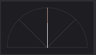

# Музыкальная теория для дурачьков или как там

Основа любого звука - пространственное размещение.

Основа мелодии - звуки (аккорды) во времени (темп и размер такта).

Основа музыки - несколько мелодий, собранных в едином звуковом пространстве.

## Три основных параметра звука (пространственное размещение)

```
1. Частота (y)
	Частота звука влияет на высоту, а вместе с темпом - на температуру

2. Ширина звука (z)
	Чем меньше ширина звука (моно), тем ближе звук к слушателю, чем больше - тем дальше.
	Ширина звука связана с панорамой

3. Панорама (z)
	Определяет направление звучания.
```

([полезновое ссылка по частоте - тык](https://ru.wikipedia.org/wiki/%D0%A7%D0%B0%D1%81%D1%82%D0%BE%D1%82%D0%B0))

Каждый из параметров позволяет уместить несколько одновременно играющих инструментов в одном промежутке времени так, чтобы они не мешали друг другу.

### Поясняющие анимации

Низкие частоты


Средние частоты


Высокие частоты


Звук играет по центру, с минимальной шириной. (моно)



Звук играет слева, ширина минимальна.


Звук играет справа, ширина минимальна.


Звук играет по центру, с большой шириной. (обычное стерео)


Звук играет слева, с большой шириной. (из-за большей ширины звук теперь слышно и справа, но намного тише)


Звук играет справа, с большой шириной.


## Ноты и время

### Темп - определяет скорость музыки (обычно удары в минуту, т. е. кол-во нот в минуту).

Темп - достаточно простое понятие в музыке. Он может меняться или оставаться константным на протяжении всей мелодии.

У большинства жанров есть свой диапазон темпов.

Темп определяет скорость всей мелодии, а не отдельных нот.

Темп в FL Studio выставлен на 172 удара в минуту:


### Размер такта

Размер такта записывается как дробь, сверху - количество долей в такте, снизу - длительность одной доли

При увеличении числителя (количества долей) сам такт вмещает больше нот, становясь больше, т. е. время, за которое проходит один такт - увеличивается. Здесь и создаётся `ритмичность`

Есть два простых размера - 2/ и 3/.

2/ можно охарактеризховать как сильную и слабую долю, следующую за ней (либо наоборот), т. е. `Ы! ы Ы! ы` либо `ы Ы! ы Ы!`, где `Ы!` - сильная доля, а `ы` - слабая (мы же так записываем ноты?)

3/ - сильная и две слабых доли: `Ы! ы ы Ы! ы ы`, `ы Ы! ы ы Ы! ы`, `ы ы Ы! ы ы Ы!`

Из простых размеров создаются сложные. Например 4/ = 2/ + 2/, 6/ = 2/ + 2/ + 2/ или 3/ + 3/. Здесь сильная доля ставится только в одном  из составляющих размеров, в остальных - относительно сильные

6/8 - `Ы! ы ы Ы ы ы` (можно хоть `ы Ы ы ы Ы! ы`)

Вообще размер такта - одна из самых сложных тем, имхо те же частота-ширина-панорама воспринимаются намного легче.

Ещё одна простая вещь - ноты с одинаково сильной долей можно абсолютно спокойно объединить в одну, т. е. превратить `Ы! ы Ы ы ы` в `Ы! ы Ы ыы` (типа `ыы` звучит в 2 раза дольше чем `ы`)

На изображении ниже простая мелодия, в которой есть переход от размера 3/4 к 4/4 и затем к 5/4. Ритмичность выражается в "громкости" (на самом деле это не громкость, но об этом чуть позже), размеченной снизу, в панели `Control`


https://github.com/AlmiriQ/music/raw/main/sounds/metre_3-5over4.mp4

При увеличении знаменателя (длительности доли) уменьшается длительность звучания одной ноты. Таким образом при 6/4 одна нота занимает 1/4 такта, а при 6/8 - 1/8. По сути просто одна и та же нота будет звучать дольше/меньше в 2/4/8 раз. Но никто не мешает разбить одну ноту на несколько, конечно.

На этом изображении переход от ритма 6/4 к 6/8. (аналогично ритм задан в панели `Control`, но теперь он выражен и в высоте (звука) ноты)


https://github.com/AlmiriQ/music/raw/main/sounds/metre_6over4and8.mp4

В общем смысле ритм помогает создать упорядоченное звучание с повторением, но ломать ритм в творческих целях никто не запрещал, но если всё же хочется создать что-то *необычное*, то лучше сначала выучить базу.

Чисто технически ритм можно задать почти любым параметром звука, проще всего это сделать через громкость для примера.
Могут использоваться разные ударные инструменты для ритма, создаваемого ударными. (для чего они отлично в общем-то и подходят)

## Динамика звука, громкость

Громкость - одна из самых базовых и сложных тем. Вообще, здесь стоит начать с математической модели звуковой волны, так что эта подтема будет одной из первых.

### Математическая модель звука

Звуковые волны в математическом представлении выглядят как колебание громкости (ось Y) во времени (ось X). Максимальное значение громкости - амплитуда (а минимальное - амплисюда, хехе). Чуть ниже представлено изображение двух звуковых волн (левая и правая) в программе Audacity.


Отрицательные значения от положительных в общем-то не отличаются, но они важны для мастеринга композиции - если сложить две волны, одна из которых находится в диапазоне положительных значений, а другая - в отрицательных, то они обе станут тише ([Интерферения](https://ru.wikipedia.org/wiki/%D0%98%D0%BD%D1%82%D0%B5%D1%80%D1%84%D0%B5%D1%80%D0%B5%D0%BD%D1%86%D0%B8%D1%8F_%D0%B2%D0%BE%D0%BB%D0%BD)), а при совпадающих знаках - громче, из-за чего они могут выйти за пределы громкости и будут "урезаны". (пример на изображении ниже)


### Громкость в музыке

Лимит громкости зависит от устройства, воспроизводящего трек, но для обозначения относительной громкости используются децибелы. Бел - логарифмическая (по основанию 10) единица громкости, т. е. 2 Бел - в 10 раз больше, чем 1 Бел, а 5 Бел - в 1000 раз больше, чем 2 Бел. 1 Бел = 10 дБ, т. е. 20 дБ = 10 * (10 дБ).

Начальной точкой отсчёта громкости можно считать 0 дБ (максимальная громкость), от неё идут -10 дБ (в 10 раз тише), -20 дБ (в 20 раз тише) и т. д. (могут использоваться значения не кратные 10 и даже дробные, например -1.2 дБ)

Диапазон значений громкости в 16тибитном wav файле - 96 дБ (от 0 дБ до -96.3 дБ), в 24битном - 144 дБ (от 0 дБ до -144.5 дБ), в 32битном - 1528 дБ (от -758 дБ до 770 дБ). ([источник](https://www.sounddevices.com/32-bit-float-files-explained/))

Резкие повышения громкости или превышения лимитов громкости, созданные из-за кривожопого мастеринга ощущаются как неприятные щелчки, шум и прочая бесовщина.

Громкость трека в дБ всё равно измеряют достаточно редко, т. к. при необходимости увеличить громкость трека может любой дурак.

Более того, слишком громкий трек может ощущаться тихо из-за маленького диапазона громкости. В общем, главное - не размер, а как ей пользоваться.

### RMS & LUFS

В любом случае, амплитуда отображает пиковые значения - те, что появляются на доли миллисекунд, так что даже могут быть не слышны человеческому уху. Возможно, для компьютера это и удобный способ представления громкости, но не для людей, поэтому был создан RMS (Root Mean Square - [среднеквадратическое значение](https://ru.wikipedia.org/wiki/%D0%A1%D1%80%D0%B5%D0%B4%D0%BD%D0%B5%D0%B5_%D0%BA%D0%B2%D0%B0%D0%B4%D1%80%D0%B0%D1%82%D0%B8%D1%87%D0%B5%D1%81%D0%BA%D0%BE%D0%B5)) - среднее значение громкости за ~ 1/3 секунды.

И всё же стандартом для измерения громкости считается LUFS: работает он так же, как и RMS, но измеряет среднюю громкость в ограниченном диапазоне частот (~1-3 КГц): это позволяет измерять громкость, которая больше приближена к тому, что слышит человек. ([видосик по теме](https://youtu.be/Q77LUeFOovY))

### Velocity

В MIDI формате (в Piano Roll в FL Studio в частности) есть понятие Velocity. Оно схоже с громкостью ноты, но ей не является. Этот параметр отвечает за "силу извлечения звука" из инструмента, т. е. силу удара по клавише/струне и т. д. Благодаря нему виртуальные инструменты могут звучать (почти) так же, как и настоящие и есть возможность исправить криво записанный MIDI.

Мяу мяу мяу мяу
